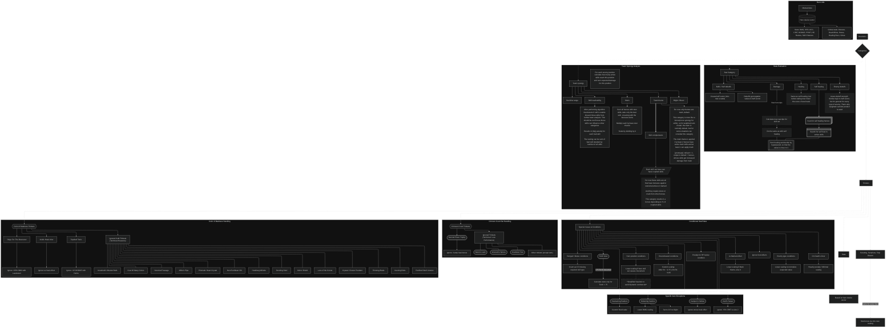

```mermaid
---
config:
    maxEdges: 10000
    maxTextSize: 500000
    theme: dark
    layout: elk
---
flowchart TB

    %% Global Hierarchy
    B("Heuristics") --> n1{"Categories"}

    %% ----------------------------------------------------
    %% SUBGRAPH 1: HERO UTILS & DESIRE VECTOR
    %% ----------------------------------------------------
    subgraph s1["Hero Utils"]
        n17["Manual data"] --> n18[("Hero desire vector")]
        n18 --> n25["Stats: DMG, SPD, ACC, CRIT, DODGE, PROT, HP, Resists, Skill Chances"]
        n18 --> n26["Global stats: Disease, Death Blow, Stress, Healing Recv, Virtue"]
    end

    %% ----------------------------------------------------
    %% CATEGORY BRANCHES
    %% ----------------------------------------------------
    n1 -.-> n6
    n1 -.-> n7["Team synergy"]
    n1 --> n12["Trinkets"]

    %% ----------------------------------------------------
    %% SUBGRAPH 2: STAT CATEGORIES & SCALING
    %% ----------------------------------------------------
    subgraph s2["Stats Evaluation"]
        n88["Asses debuff strength  Similar logic to buff vector, but it's general for every type of enemy  That's why weighted sum/dot product is used"]
        n87["Same as self healing, but before taking max lower the score of aoe heals"]
        n80["Do the same as with self healing"]
		n79["Calculate max raw dps for skill set"] --> n80
		n59@{ shape: "fr-rect", label: "Sum healing and devide by hyperparam, so that the value is close to 1" }
		n69@{ shape: "text", label: "Raw hero dps" }
        n6["Stat Category"] --> n11["Damage"]
        n6 --> n2["Healing"]
        n2 --> n87
        n6 --> n3["Self healing"]
        n6 --> n4["Buffs / Self debuffs"]
        n6 --> n5["Enemy debuffs"]
        n5 --> n88
        n3 --> n85@{ shape: "st-rect", label: "Scan for self healing heroes" } --> n86@{ shape: "div-rect", label: "Search for self heal in active skills" }
        n4 --> n83["Create buff vector (min-max scaled)"]
        n4 --> n84["Debuffs get negative values in buff vector"]
    end

    %% ----------------------------------------------------
    %% SUBGRAPH 3: TEAM SYNERGY
    %% ----------------------------------------------------
    subgraph s_syn["Team Synergy Analysis"]
        n92["Sum all heroes with stun skills, take only the best skill - meaning with the best aoe stuns<br><br>Multiply each by base stun chance<br><br>Scale by dividing by 4"]
        n93["For now only themes are: mark, default<br><br>This category is more like a bonus(more synergy for skills), so for weighted sum model, the team is normally default, but for some situations we consider this category<br><br>The mark theme is applied if at least 2 heroes have active mark skills and at least 1 can apply mark<br><br>[prototype]: default = 1, output is default + heroes, whose skills get increased damage from mark"]
        n94["For each enemy position calculate how many active skills reach this position and sum expected damage for this position<br><br>"]
        n7 --> n8["Skill reachability"]
        n7 --> n13["Backline range"]
        n7 --> n14["Stuns"]
        n7 --> n16["Blight / Bleed"]
        n7 --> n10["Team theme"]
        n10 ==> n9["Skill complements"]
        n9 --> n89@{ shape: "lean-r", label: "Each skill can have can have coupled skills" }
        n90@{ label: "For now these skills are all that have bonuses against stuned enemies or marked<br><br>And they require stuns or mark from other heroes<br><br>This category results in a bonus depending on % of coupled skills" }
        n91["After performing algorithm that detects if skill is usable discard those skills from further team analysis. This should be run first as those skill can influence other categories<br><br>Results in (big) penalty for each bad skill<br><br>The scaling can be sum of bad skill devided by number of all skills"]
        n89 --> n90
        n8 --> n91["After performing algorithm that detects if skill is usable discard those skills from further team analysis. This should be run first as those skills can influence other categories<br><br>Results in (big) penalty for each bad skill<br><br>The scaling can be sum of bad skill devided by number of all skills"]
        n14 --> n92
        n10 --> n93
    end

    %% ----------------------------------------------------
    %% TRINKETS ROUTING
    %% ----------------------------------------------------
    n12 --> n15["Stats"]
    n12 --> n22["Scouting, Surprises, Trap Disarm"]
    n12 --> n19["Special Cases & Conditions"]
    n12 --> n60{{"Crimson Court Trinkets"}}
    n12 --> n66{{"Color of Madness Trinkets"}}

    n15 --> n20["Based on hero desire vector"]
    n22 -- "Same for every hero" --> n23["Stat bonus via min-max scaling"]

    %% ----------------------------------------------------
    %% SUBGRAPH 4: SPECIAL CONDITION HANDLERS
    %% ----------------------------------------------------
    subgraph s_cond["Conditional Stat Rules"]
        n19 --> n21(["Torch level"])
        n21 -- ">75 Torch Assumed" --> n34["Calculate stats only for Torch > 75"]

        n19 --> n27["Ranged / Melee conditions"]
        n27 --> n28["Count as 0 if missing required skill type"]

        n19 --> n35["Enemy type conditions"]
        n35 --> n36["Lower scaling to normalize expected value"]

        n19 --> n37["Hero position conditions"]
        n37 --> n38["Lower scaling if hero skill set causes movement"]
        n38 -.- n39["*Simplified heuristic to avoid dynamic combat sim*"]

        n19 --> n42["Round-based conditions"]
        n42 --> n43["Custom scaling:<br>After R1: ~0.75 | On R1: ~0.25"]

        n19 --> n44["On Death's Door"]
        n44 --> n45["Heavily penalty / Minimal scaling"]

        n19 --> n54["vs Marked effect"]
        n54 --> n55["Lower scaling if Mark theme, else 0"]

        n19 --> n33["Penalty for HP below condition"]
        n19 --> n50["Ignore food effects"]
    end

    %% ----------------------------------------------------
    %% SUBGRAPH 5: BASE TRINKET EXCEPTIONS
    %% ----------------------------------------------------
    subgraph s_exceptions["Specific Item Exceptions"]
        n19 --> n46(["Restraining Padlock"]) --> n47["Custom fixed value"]
        n19 --> n48(["Camper's Helmet"]) --> n49["Ignore stress heal effect"]
        n19 --> n51(["Sickening Satchel"]) --> n52["Lower DMG scaling"] & n53["Set to 0 if no blight"]
        n19 --> n56(["Vvulf's Tassel"]) --> n57["Ignore +5% CRIT vs size 2"]
    end

    %% ----------------------------------------------------
    %% SUBGRAPH 6: CRIMSON COURT
    %% ----------------------------------------------------
    subgraph s_cc["Crimson Court Set Handling"]
        n60 --> n64(["Second Place Trophy"]) --> n65["Ignore: Camp heal bonus"]
        n60 --> n59_cc["Ignored Trinkets<br>(Technical / Low Performance)"]
        n59_cc --- n58(["Viscount's Spices"])
        n59_cc --- n61(["Baron's Lash"])
        n59_cc --- n62(["Countess' Fan"])
        n59_cc --- n63["Other trinkets (except sets)"]
    end

    %% ----------------------------------------------------
    %% SUBGRAPH 7: COLOR OF MADNESS
    %% ----------------------------------------------------
    subgraph s_com["Color of Madness Handling"]
        n66 --> n24["Acidic Husk Ichor"] --> n29["Ignore vs Husk effect"]
        n66 --> n30["Topshelf Tonic"] --> n31["Ignore +15 DODGE with Herbs"]
        n66 --> n41["Dirge For The Devoured"] --> n72["Ignore +25% DMG with Laudanum"]

        n66 --> n79_com["Ignored CoM Trinkets<br>(Technical Reasons)"]
        n79_com --- n67["Lens of the Comet"]
        n79_com --- n68["Crystal / Cluster Pendant"]
        n79_com --- n70["Coat Of Many Colors"]
        n79_com --- n71["Miller's Pipe"]
        n79_com --- n73["Smoking Skull"]
        n79_com --- n74["Keening Bolts"]
        n79_com --- n75["Non-Euclidean Hilt"]
        n79_com --- n76["Petrified Skull / Amulet"]
        n79_com --- n77["Heretical Passage"]
        n79_com --- n78["Prismatic Heart Crystal"]
        n79_com --- n32["Thirsting Blade"]
        n79_com --- n40["Huskfang Whistle"]
        n79_com --- n81["Mirror Shield"]
        n79_com --- n82["Icosahedric Musket Balls"]
    end

    %% Style Overrides
    style n18 fill:#1a1a1a,stroke:#888
    style s1 fill:#111111,stroke:#555
    style s2 fill:#111111,stroke:#555
    style s_syn fill:#111111,stroke:#555
    style s_cond fill:#111111,stroke:#555
    style s_exceptions fill:#111111,stroke:#555
    style s_cc fill:#111111,stroke:#555
    style s_com fill:#111111,stroke:#555
    style n39 stroke-dasharray: 3 3
	n86
	n86
	n11
	n11 --- n69
	n86 --- n59
	n69
	n69 --- n79
	n80 --- n59
	style n80 stroke-width:0.5px,stroke-dasharray:5 5
	style n79 stroke-width:0.5px,stroke-dasharray:5 5
	style n87 stroke-width:0.5px,stroke-dasharray:5 5
	style n88 stroke-width:0.5px,stroke-dasharray:5 5
	style n89 stroke-width:0.5px
	style n90 stroke-width:0px
```