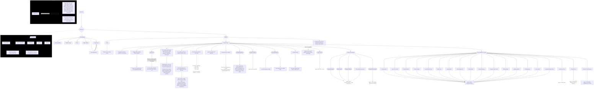

```mermaid
---
config:
    maxEdges: 1000
---
flowchart TB
 subgraph s1["Hero Utils"]
        n17["Manual data"]
        n18["Hero desire vector"]
        n25["Stats: DMG, SPD, ACC, CRIT chance, DODGE, PROT, Max HP, Stun res, Blight res, Bleed res, Move res, Debuf res, Stun skill chance, Blight skill chance, Bleed skill chance, Move skill chance, Healing skills, Stress skills"]
        n26["Global stats: Disease res, death blow res, stress recieved, Healing recieved, Virtue chance"]
  end

 subgraph s2["Stats"]
		n84
        n6["Stat Category"]
        n5["Enemy debuffs"]
        n4["Buffs / Self debuffs"]
        n3["Self healing"]
        n2["Healing"]
        n11["Damage"]
        n83["j"]
        n6 --> n5 & n4 & n3 & n2 & n11
        n4 --> n83["Create buff vector with min max scaling across all buffs"]
  end

    n17 -- Vector representing befits --> n18
    n18 --> n25 & n26
    B("Heuristics") --> n1["Categories"]
    n1 -.- n6
    n1 -.-> n7["Team synergy"]
    n7 --> n8["Skill reachability"] & n9["skill complemetns"] & n10["Team theme"] & n13["Backline range"] & n14["Stuns"] & n16["Blight / Bleed"]
    n10 ==> n9
    n1 --> n12["Trinkets"]
    n12 --> n15["Stats"] & n19["Special cases"] & n22["Scouting, party surprised, monster surprised, trap dissarm chance effects"]
    n15 --> n20["Based on hero desire vector"]
    n19 --> n21(["Torch level"]) & n27["Ranged skills or Melee skills conditions"] & n33["Penalty for hp bellow condition to stat scaling"] & n35["For conditions with enemy types lower the scaling<br>So it is like expected damage no matter the enemy type"] & n37["For conditions with hero position do binary check"] & n42["After first round and On first round"] & n44@{ label: "On death's door condition" } & n46(["Restraining padlock"]) & n48@{ label: "Camper's Helmet" } & n50["Ignore food effects for simplicity"] & n51(["Sickening Satchel"]) & n54["vs Marked effect"] & n56@{ label: "Vvulf's Tassle" } & n60["Crimson court trinkets"] & n66["Color of Madness Trinkets"]
    n22 -- Same for every hero --> n23["Bonus for these stats based on simple stat min-max scaling"]
    n27 --> n28["Count as 0 in trinket vector if no ranged/melee skills"]
    n21 -- Assume that player wants to have torch level above 75 for fights --> n34["For time being, calculate stats only for if torch above 75"]
    n35 --> n36["Disadvantage is that user has to decide if this trinket is good for dungeon type<br><br>Otherwise, these trinkets would be abandoned. And there are plenty of good trinkets with these conditions"]
    n37 --> n38["If position matches set lower scaling if skills move the hero"]
    n38 --> n39["`*This is rather a simple solution for this complex case<br>Other would require deciding how often hero attacks from this position, which is technically difficult to implement*`"]
    n42 --> n43["Set custom scaling for these stats<br>After: ~0.75<br>On: ~0.25<br><br>If a stat occur in both situation - calc mean"]
    n44 --> n45@{ label: "Give these stats really low scaling<br>Hero should be as little as possible at death's door" }
    n46 --> n47["Custom trinket value, because effect is too abstract for algorithm and hero constraint makes the situation same for every build"]
    n48 --> n49["Ignore stress heal effect"]
    n51 --> n52["Lower the Damage scaling"] & n53["Set scaling to 0 if no blight skills"]
    n54 --> n55["Set lower scaling if team theme is mark, else 0"]
    n56 --> n57["Ignore +5% CRIT vs size 2"]
    n58@{ label: "Viscount's Spices" } --> n59["Ignore trinket<br>Technical reasons + bad performance"]
    n60 --> n58 & n61@{ label: "Baron's Lash" } & n62@{ label: "Countess' Fan" } & n63["Other trinkets except sets"] & n64(["Second Place Trophy"])
    n61 --> n59
    n62 --> n59
    n63 --> n59
    n64 --> n65["Ignore: +20% Healing Skills while Camping"]
    n66 --> n67["Lens of the Comet"] & n68["Crystal Pendant"] & n69["Cluster Pendant"] & n70["Coat Of Many Colors"] & n71@{ label: "Miller's Pipe" } & n73["Smoking Skull"] & n74["Keening Bolts"] & n75["Non-Euclidean Hilt"] & n76["Petrified Skull"] & n77["Heretical Passage"] & n78["Prismatic Heart Crystal"]
    n73 --> n79["Ignore trinket
Technical reasons"]
    n67 --> n79
    n68 --> n79
    n69 --> n79
    n70 --> n79
    n71 --> n79
    n74 --> n79

    n18@{ shape: h-cyl}
    n1@{ shape: diam}
    n6@{ shape: card}
    n7@{ shape: card}
    n12@{ shape: card}
    n44@{ label: "On death's door condition" }
    n48@{ shape: "stadium", label: "Camper's Helmet" }
    n56@{ shape: "stadium", label: "Vvulf's Tassle" }
    n60@{ shape: hex}
    n66@{ shape: hex}
    n43@{ shape: text}
    n45@{ shape: text}
    n49@{ shape: text}
    n57@{ shape: text}
    n58@{ shape: stadium}
    n59@{ shape: text}
    n61@{ shape: "stadium", label: "Baron's Lash" }
    n62@{ shape: "stadium", label: "Viscount's Spices" }
    n65@{ shape: text}
    n71@{ label: "Miller's Pipe" }
    style n18 fill:#000000
    style n39 stroke-width:2px,stroke-dasharray: 2
    style s1 fill:#000000,stroke:#757575
    n79
    n75
    n75 --- n79
    n76 --- n79
    n77 --- n79
    n78 --- n79
    n66 --- n24["Acidic Husk Ichor"]
    n24 --- n29@{ shape: "text", label: "Ignore vs Husk effect" }
    n66 --- n30["Topshelf Tonic"]
    n30 --- n31@{ shape: "text", label: "Ignore +15 DODGE if Medicinal Herbs in inventory" }
    n66 --- n32["Thirsting Blade"]
    n32 --- n79
    n66 --- n40["Huskfang Whistle"]
    n40 --- n79
    n66 --- n41["Dirge For The Devoured"]
    n41 --- n72["Ignore +25% DMG if Laudanum in inventory"]
    n66 --- n80["Petrified Amulet"]
    n80 --- n79
    n66 --- n81["Mirror Shield"]
    n81 --- n79
    n66 --- n82["Icosahedric Musket Balls"]
    n82 --- n79
	style s2 fill:#000000,stroke:#737373
	n4
	n4 --- n84["Debuffs get negative values in buff vector"]
```